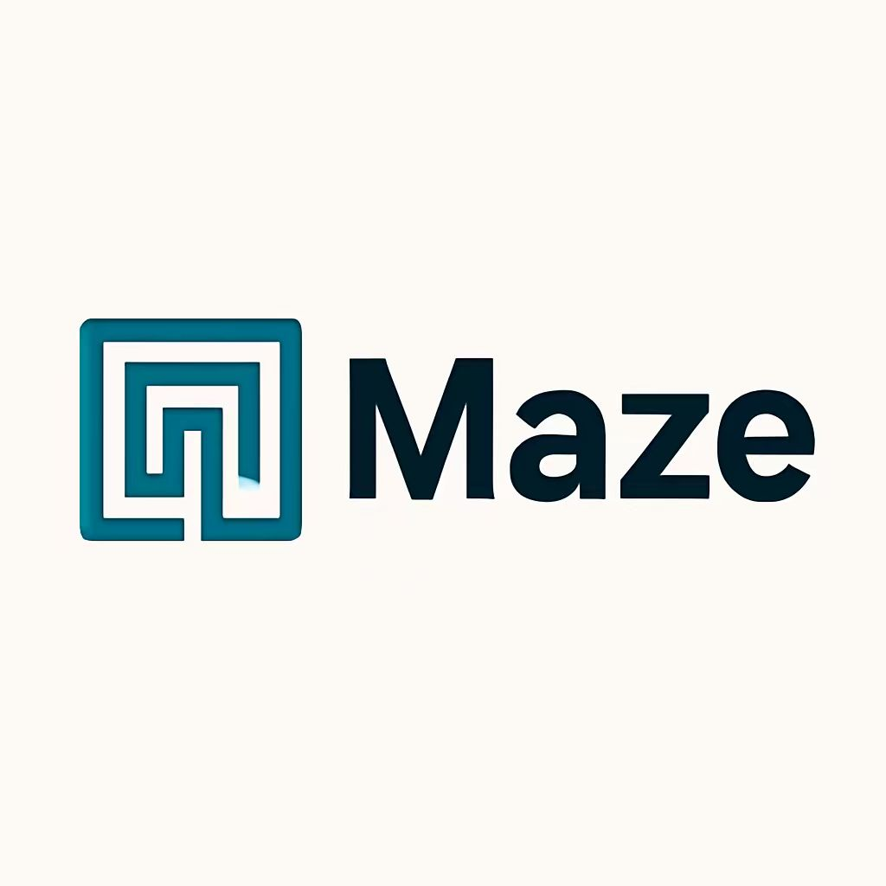

# Maze:A Task-Level Distributed Agent Framework

[**Documentation**](https://maze-doc-new.readthedocs.io/en/latest/)
<p align="center">
  
</p>
<br>
 


# 🌟Why  Maze？
- **Task-level parallelism**

  Unlike LangGraph’s agent-level execution model—which runs the entire agent workflow sequentially in a single process—Maze employs task-level parallelism, enabling true concurrent execution of individual tasks. In compute-intensive scenarios, Maze can significantly improve end-to-end (e2e) performance. **Moreover, Maze can serve as a runtime backend for LangGraph**, allowing existing LangGraph workflows to be seamlessly migrated to Maze and automatically gain task-level parallelism without modifying original logic. [**Example**](https://github.com/QinbinLi/Maze/tree/develop/examples/financial_risk_workflow)

- **Resource Management**

  When multiple tasks run in parallel within a single workflow—or when multiple workflows execute concurrently—resource contention can occur. Without proper coordination, this may lead to severe resource overloads, such as GPU out-of-memory (OOM) errors.

- **Distributed Deployment**

  Maze supports not only standalone but also distributed deployment, allowing you to build highly available and scalable Maze clusters to meet the demands of large-scale concurrency and high-performance computing.

<br>


# 🚀Quick Start

## 1. Install

**From source**

   ```
   git clone https://github.com/QinbinLi/Maze.git
   cd Maze
   pip install -e .
   ```
## 2. Launch Maze
   Launch Maze Head.

   ```
   maze start --head --port HEAD_PORT
   ```
   If there are multiple machines, you can start multiple Maze workers.
   ```
   maze start --worker --addr HEAD_IP:HEAD_PORT
   ```
## 3. Example

```python
from typing import Any
from maze import MaClient,task

#1.Define your task functions using the @task decorator
@task(
    inputs=["text"],
    outputs=["result"],
)
def my_task(params):
    text: Any = params.get("text")
    return {"result": f"Hello {text}"}

#2.Create the maze client
client = MaClient("http://localhost:8000")

#3.Create the workflow
workflow = client.create_workflow()
task1 = workflow.add_task(
    my_task,
    inputs={"text": "Maze"}
)

#4.Submit the workflow and get results
workflow.run() 
for message in workflow.get_results():
    msg_type = message.get("type")
    msg_data = message.get("data", {})

    if msg_type == "start_task":
        print(f"▶ Task started: {msg_data.get('task_id')}")

    elif msg_type == "finish_task":
        print(f"✓ Task completed: {msg_data.get('task_id')}")
        print(f"  Result: {msg_data.get('result')}\n")

    elif msg_type == "finish_workflow":
        print("🎉 Workflow completed!")
        break
   
```
<br>


# 🖥️ Maze Playground
We support building workflows through a drag-and-drop interface on the Maze Playground.Here are two pages for reference. For detailed usage instructions, please refer to the [**Maze Playground**](https://maze-doc-new.readthedocs.io/en/latest/playground.html).


### Design Workflow
  
[Design Workflow Video](https://meeting-agent1.oss-cn-beijing.aliyuncs.com/create_workflow.mp4)

### Check Result
  
[Check Result Video](https://meeting-agent1.oss-cn-beijing.aliyuncs.com/check_result.mp4)


