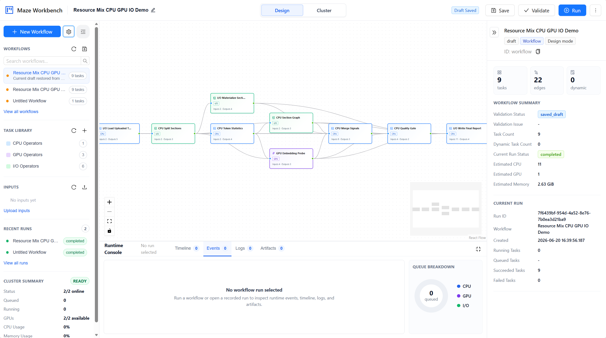
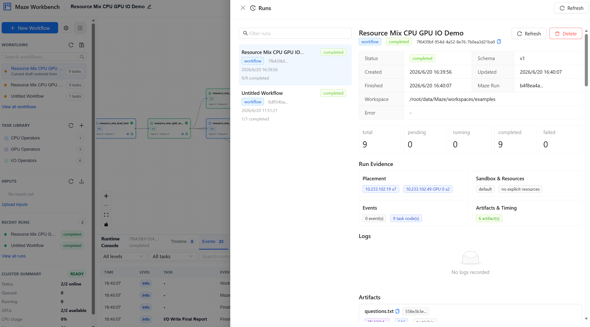
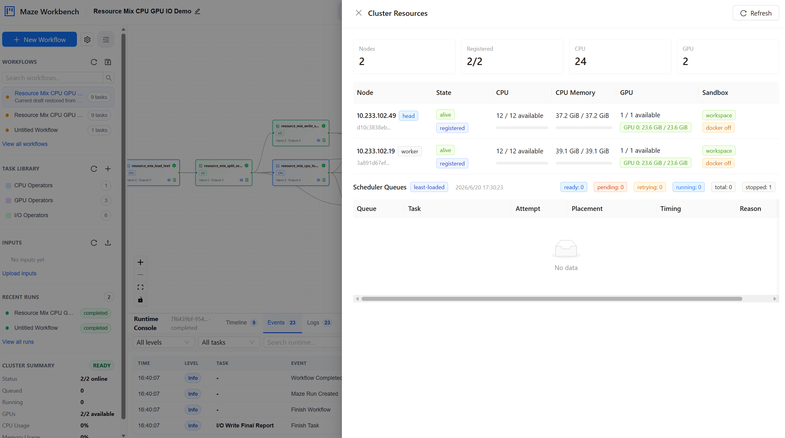

<h2 align="center"> Maze: A Distributed Framework for LLM Agents</h2>

<p align="center">
    <a href="https://mazeagent.net/">
        
    </a>
    <a href="https://maze-doc-new.readthedocs.io/en/latest/">
        
    </a>
</p>


Maze turns agent programs into distributed, observable workflows. It schedules task-level work across heterogeneous resources while keeping execution, recovery, and artifacts behind one runtime API.

## 🌟 Highlights

- **Visual workflow development.** Maze Workbench provides a DAG editor, reusable task catalog, workspace files, validation, live execution, Run inspection, and cluster operations in one interface.
- **Heterogeneous scheduling.** Independent `gpu`, `cpu`, and `io` queues prevent one resource class from blocking the others. Maze supports `FCFS` and the paper-aligned `HACS` scheduling algorithm, with node placement configured separately.
- **Static and dynamic workflows.** Define DAGs with `@workflow`, submit the portable `maze.workflow/v1` format, or append tasks at runtime with persisted `DynamicRun` state.
- **Distributed model execution.** Maze discovers local models across nodes, routes LLM tasks to reusable inference instances, and manages GPU reservations and model scale-out/scale-in through the scheduler.
- **Durable operations.** Runs retain task state, structured errors, events, logs, retries, timeouts, cancellation, placement, and content-addressed artifacts across process restarts.
- **Framework integration.** The Python SDK, LangGraph adapter, visual Workbench, and application specs use the same Core execution and observability surface.

## Current Architecture

Maze has one execution path and one owner for runtime state:

```text
Python SDK / LangGraph / Workbench
                  |
          POST /workflows/submit
                  |
             Maze Core
       Run, events, logs, artifacts
                  |
       Scheduler + Ray workers
        gpu / cpu / io queues
```

- **Core owns Runs.** A Core `run_id` is the only public run identity. Static workflows, DynamicRuns, and application specs share the same persisted snapshots, events, logs, artifacts, cancel, and retry APIs.
- **Clients submit DAGs.** The Python SDK, LangGraph adapter, and Workbench all submit `maze.workflow/v1` specs through `/workflows/submit`. The Workbench backend manages workspace files and proxies Core APIs; it does not execute or mirror a second workflow.
- **Catalog and workspace are explicit.** `system_catalog/tasks` and `system_catalog/workflows` contain built-in templates. User-edited workflow and task files remain in their workspace.
- **Scheduling is heterogeneous.** Ready work enters separate `gpu`, `cpu`, and `io` queues. `FCFS` is the default scheduling algorithm; `HACS` adds topology- and runtime-aware ordering. Node placement is configured independently.
- **Runs survive failures.** Run-level deadlines, structured failures, worker re-registration, scheduler interruption handling, durable artifacts, and restart-safe discovery keep execution state inspectable after process failure.
- **Dynamic workflows remain first-class.** Runtime task append, lifecycle events, cancellation, timeout, and persisted recovery use Core `DynamicRun` rather than a second agent loop.

The implementation is built on Ray for distributed processes and task execution. Maze adds the workflow contract, task/resource semantics, durable Run state, scheduling policy, model lifecycle, artifacts, and operational APIs above Ray.

## 📰 News

- **2026-08**: Maze unified SDK, LangGraph, and Workbench DAG execution around Core-owned Runs and the `/workflows/submit` contract.
- **2026-07**: Maze added paper-aligned heterogeneous scheduling, distributed recovery, run deadlines, and restart-safe discovery. The Maze research paper was accepted to SC26.
- **2026-06**: Maze added unified run operations, content-addressed artifacts, local model routing, cluster management, and runtime fault-tolerance traces.
- **2026-05**: Maze added persisted DynamicRuns, workspace file execution, and the Workbench `Runs` and `Cluster` views.

<br>


## 🚀 Quick Start

### 1. Install

**From PyPI (Recommended)**

   ```bash
   pip install maze-agent
   ```

**From source**

   ```bash
   git clone https://github.com/maze-agent/Maze.git
   cd Maze
   pip install -e .
   ```
### 2. Launch Maze
   Launch Maze Head as maze server. The maze server can receive the workflow of the agent.

   ```bash
   maze start --head --port HEAD_PORT
   ```
   The head uses the `least-loaded` node placement policy by default, so ready tasks prefer the registered node with the fewest running Maze tasks. To force the older registration-order placement behavior, pass `--strategy default`.

   Task scheduling is selected separately. `FCFS` is the default task scheduling algorithm; pass `--scheduling-algorithm HACS` to enable the paper-aligned HACS queue ordering:

   ```bash
   maze start --head --port HEAD_PORT --scheduling-algorithm HACS
   ```

   To enable the optional warm standby execution path for scheduled tasks:

   ```bash
   MAZE_STANDBY_EXECUTION_ENABLED=1 maze start --head --port HEAD_PORT
   ```

   If there are multiple machines, you can connect other machines as maze workers to the maze head.
   ```bash
   maze start --worker --addr HEAD_IP:HEAD_PORT
   ```
   For long-running worker processes that should re-register after a head/core restart, run the worker agent:
   ```bash
   maze start --worker --addr HEAD_IP:HEAD_PORT --agent --heartbeat-interval 20
   ```
   You can inspect the scheduler-visible cluster state with:
   ```bash
   curl http://HEAD_IP:HEAD_PORT/cluster/resources
   ```
   A Ray worker that has joined Ray but has not registered with Maze will appear under `unregistered_ray_nodes`; it must still be started as a Maze worker before Maze can schedule tasks to it.
   Common cluster operations are also available from the CLI:
   ```bash
   maze cluster resources --server-url http://HEAD_IP:HEAD_PORT
   maze cluster queues --server-url http://HEAD_IP:HEAD_PORT
   maze cluster join-command --server-url http://HEAD_IP:HEAD_PORT
   maze cluster reconcile-workers --server-url http://HEAD_IP:HEAD_PORT
   ```

   Queue snapshots include the active scheduling algorithm, per-resource queue counts, pending and retry reasons, prediction metadata, and HACS score details when available. Cluster resources also report standby worker pool targets and busy/idle execution state.
### 3. Example

### Static Workflow

```python
from maze import MaClient, task, workflow

@task(resources={"cpu_num": 1, "gpu_mem": 0, "io_num": 0})
def greet(text: str):
    return {"result": f"Hello {text}"}


@task(resources={"cpu_num": 1, "gpu_mem": 0, "io_num": 0})
def uppercase(result: str):
    return {"upper": result.upper()}


@workflow
def hello(name: str):
    greeting = greet(name)
    return uppercase(greeting.result)


client = MaClient("http://localhost:8000")
workflow_run = client.create_workflow_from(hello, inputs={"name": "Maze"})
run_id = workflow_run.run()
run = client.wait_run(run_id)
print(run["result_summary"])
```

`@workflow` builds the DAG without executing task functions locally. For visual and external DAG builders, `MaClient.submit_workflow(spec)` submits the same `maze.workflow/v1` contract directly to `/workflows/submit`.

### Dynamic Workflow

```python
from maze import MaClient, task


@task(resources={"cpu_num": 1, "gpu_mem": 0, "io_num": 0})
def summarize(topic: str = ""):
    return {"summary": f"Maze can build workflows dynamically for {topic}."}


client = MaClient("http://localhost:8000")

run = client.create_dynamic_run(max_tasks=10)
summary = run.append_task(
    summarize,
    inputs={"topic": "agent runtime"}
)
run.wait_for_task(summary)
run.finalize({"status": "done"})
print(run.status())
```

In Maze Playground, files uploaded under `workspace/files` are staged into each task sandbox. Task code should read and write files with relative paths such as `Path("input.csv")`, `Path("folder/data.json")`, or `Path(".")`; it should not hard-code `workspace/files/...`.

For distributed runs without shared storage, Maze can register workspace inputs and task outputs in a content-addressed artifact store. Workers download required files before task execution and upload changed files after execution; manifests use stable artifact references such as `maze://artifacts/sha256/<hash>` instead of machine-local paths. A workflow can enable the head HTTP artifact store with:

```python
run_id = workflow.run(
    workspace_dir="/tmp/my_workspace",
    artifact_mode=True,
)
```

For lower-level control, pass an explicit file context:

```python
workflow.run(file_context={
    "enabled": True,
    "workspace_dir": "/tmp/my_workspace",
    "artifact_store": {
        "type": "head_http",
        "base_url": "http://HEAD_IP:HEAD_PORT",
    },
})
```

### Application Spec

For application-style jobs, you can submit a `maze.yaml` directly:

```yaml
name: gpu-demo
command: python train.py
workspace: .
resources:
  cpu_num: 4
  gpu_mem: 8192
  io_num: 0
env:
  conda: maze
  vars:
    DATASET: sample
artifacts:
  - outputs/
timeout_seconds: 1800
retries:
  max: 1
  backoff_seconds: 5
  on: [node_lost, resource_unavailable]
```

Run and inspect it with:

```bash
maze app validate maze.yaml
maze run maze.yaml --wait
maze runs logs <run_id>
maze runs retry <run_id>
```

Each app run is recorded in the unified run history with lifecycle events, placement, logs, and artifacts.

### Run Observability and Operations

Static workflows, DynamicRuns, and application spec runs share the same operational surface. A run snapshot includes lifecycle state, timing, progress, result/error summaries, task state, placement, and artifacts. Task failures use a structured error envelope with fields such as `error_type`, `message`, `retryable`, `origin`, `node_id`, `node_ip`, `attempt`, and `traceback`.

You can configure task-level reliability directly on the decorator:

```python
@task(
    resources={"cpu_num": 2, "gpu_mem": 8192, "io_num": 0},
    timeout_seconds=300,
    max_retries=2,
    retry_backoff_seconds=5,
    retry_on=["node_lost", "artifact_error"],
)
def train_one_shard(shard: str):
    return {"status": f"finished {shard}"}
```

Python clients can query and operate on runs after submission:

```python
client = MaClient("http://localhost:8000")

runs = client.list_runs(limit=20)
run = client.get_run(run_id)
tasks = client.get_run_tasks(run_id)
events = client.get_run_events(run_id, after=None)
artifacts = client.get_run_artifacts(run_id)
logs = client.get_run_logs(run_id, tail=200)

client.cancel_run(run_id, reason="no longer needed")
client.retry_run(run_id, workspace_dir="/tmp/my_workspace")
```

The same controls are available through HTTP and CLI:

```text
GET  /runs
GET  /runs/{run_id}
GET  /runs/{run_id}/tasks
GET  /runs/{run_id}/tasks/{task_id}
GET  /runs/{run_id}/events?after=<seq>
GET  /runs/{run_id}/logs
GET  /runs/{run_id}/artifacts
POST /runs/{run_id}/cancel
POST /runs/{run_id}/retry
GET  /cluster/resources
GET  /cluster/queues
```

```bash
maze runs list --server-url http://HEAD_IP:HEAD_PORT
maze runs show <run_id> --server-url http://HEAD_IP:HEAD_PORT
maze runs events <run_id> --server-url http://HEAD_IP:HEAD_PORT
maze runs logs <run_id> --tail 200 --server-url http://HEAD_IP:HEAD_PORT
maze runs retry <run_id> --server-url http://HEAD_IP:HEAD_PORT
maze artifacts list <run_id> --server-url http://HEAD_IP:HEAD_PORT
```

<br>


## 🖥️ Maze Playground
Maze Playground supports building workflows through a drag-and-drop interface, managing workspace files, generating workspace tasks from prompts, and inspecting static, dynamic, and app runs in one `Runs` console. You can start the playground with the following command option.
```
maze start --head --port HEAD_PORT --ray-head-port RAY_HEAD_PORT --playground
```

The default Playground entry is `http://localhost:5173`. The CLI starts and wires the Maze Head, Workbench backend, and Workbench frontend together. To use a custom Playground UI port:

```bash
maze start --head \
  --port 9000 \
  --ray-head-port 6380 \
  --playground \
  --playground-port 5174
```

When the UI port is changed, the Workbench backend defaults to `--playground-port + 1`; use `--playground-backend-port` only when the backend API port must be fixed. Maze checks configured ports before startup and prints a clear error if a port is already in use or two services are configured to share one port.

The sidebar separates system workflow templates from workspace workflows and loads reusable task definitions from `system_catalog/tasks` and the active workspace. The GAIA demo is an ordinary system workflow and uses the same Core submission and Run path as user workflows.

The Workbench backend manages workspace and catalog files, compiles visual DAGs, and proxies Core APIs. Core remains the only owner of Run state. The `Runs` console shows history, task state, structured errors, placement, logs, cancel/retry actions, and artifacts for static, dynamic, and app runs. Artifact download and promotion use Core content-addressed storage.

The top toolbar also includes a `Cluster` view for checking head/worker registration, Ray-only unregistered nodes, CPU availability, GPU availability, per-node GPU memory, queue snapshots, pending reasons, retry waits, timeouts, and scheduler reject reasons. For detailed usage instructions, please refer to the [**Maze Playground**](https://maze-doc-new.readthedocs.io/en/latest/playground.html).

### Workflow Design

Maze Workbench gives workflow authors a DAG-first editor with task libraries, input management, validation, run submission, and live workflow summaries in one workspace.



### Run Inspection

The unified `Runs` console keeps completed and active runs inspectable after submission, including run evidence, placement, events, logs, and produced artifacts.



### Cluster Resources

The `Cluster` view shows registered workers, scheduler-visible CPU/GPU capacity, sandbox capabilities, queue state, and placement readiness.



## Citation

Please cite our work if you find the project useful:

```bibtex
@inproceedings{gu2026maze,
  title     = {Maze: A Distributed Framework for Large Language Model Agents},
  author    = {Jing Gu and Zhuang Xing and Yiheng Yang and Bowen Lv and Jiale Wang and Shuo Yuan and Zijin Chen and Jin Zhao and Pengfei Zuo and Long Zheng and Xiaofei Liao and Hai Jin and Qinbin Li},
  booktitle = {Proceedings of the International Conference for High Performance Computing, Networking, Storage and Analysis},
  year      = {2026}
}
```

## Acknowledgement
We thank contributors from Huazhong University of Science and Technology, Huawei, and other institutions for their support and contributions to this project.
