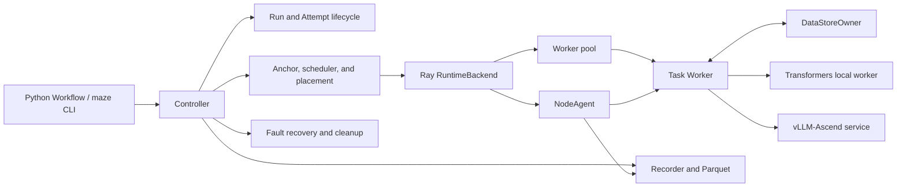

# Ascend-Maze

Ascend-Maze is a task-level static workflow runtime for Huawei Ascend clusters.
It preserves the Maze programming model based on `@task`, named outputs, and
static DAGs while adding deterministic compilation, resource-aware scheduling,
physical NPU placement, worker lifecycle management, inference routing, fault
recovery, and auditable experiment support for Ascend.

This `ascend` branch contains Ascend-Maze at the repository root. It is a
platform-specific Maze implementation, not a nested project or an installable
subpackage of another Maze branch.

The Python package is `ascend_maze`. The control-plane CLI is `maze`, and the
experiment CLI is `maze-bench`.

> **Status:** version `0.1.0` Alpha. The core C0-C13 correctness path is
> implemented. HBM calibration and a fixed Batch=20 Maze/Ray pilot have been
> completed on one 8-card Ascend 910B3 host. The current results are engineering
> evidence, not a statistically confirmed performance claim.

## Why Ascend-Maze

Ordinary task runtimes can schedule a Python function without understanding its
NPU memory demand, device binding, model lifecycle, or recovery requirements.
Ascend-Maze makes those constraints explicit and keeps the scheduling decision
inside one resource ledger.

The runtime provides:

- deterministic Task and Workflow compilation;
- static DAG execution with named inputs and outputs;
- CPU, host-memory, I/O, NPU-slot, and NPU-HBM resource semantics;
- FCFS and HACS-noTP scheduling policies;
- physical Ascend device placement and binding verification;
- one-shot NPU Workers and zero-HBM Standby Workers;
- Transformers local inference and vLLM-Ascend service integration;
- timeout, OOM, Worker, Node, data, and model-service fault handling;
- Run, Attempt, PlacementLease, WorkerLease, and RouteLease recovery;
- Controller and NodeAgent event recording with historical Parquet output;
- reproducible benchmark plans, manifests, validation, and reports.

Ray is used as a distributed execution and Object Store backend. It does not
make a second NPU-placement decision: Ascend-Maze owns admission, reservation,
device selection, and resource recovery.

## Architecture


```mermaid
flowchart LR
    User["Python Workflow / maze CLI"] --> Controller["Controller"]
    Controller --> Lifecycle["Run and Attempt lifecycle"]
    Controller --> Scheduler["Anchor, scheduler, and placement"]
    Scheduler --> Runtime["Ray RuntimeBackend"]
    Runtime --> Agent["NodeAgent"]
    Runtime --> Pool["Worker pool"]
    Pool --> Worker["Task Worker"]
    Agent --> Worker
    Worker <--> Store["DataStoreOwner"]
    Worker --> Local["Transformers local worker"]
    Worker --> Service["vLLM-Ascend service"]
    Controller --> Recorder["Recorder and Parquet"]
    Agent --> Recorder
    Controller --> Recovery["Fault recovery and cleanup"]
```

| Layer | Responsibility |
|---|---|
| C1-C2 | Task/Workflow API, output contracts, immutable IR, and deterministic fingerprints |
| C3-C4 | Run lifecycle, argument binding, DataHandle, and data ownership |
| C5-C7 | ResourceAnchor, placement ledger, heterogeneous queues, FCFS, and HACS-noTP |
| C8-C10 | Recording, Ray backend, NodeAgent, Worker pools, and Standby Workers |
| C11-C13 | Inference routing, model instances, recovery, Controller, RuntimeClient, and CLI |
| C14 | Experiment specifications, arrival plans, trials, validation, aggregation, and reports |

## Programming Model

The user-facing definition remains a normal static Workflow. Runtime data
transport, Ray ObjectRefs, placement leases, and device binding do not appear in
the Task signature.

```python
from ascend_maze import Workflow, task


@task(task_kind="cpu", resources={"cpu_num": 1, "mem": 128})
def normalize(text: str):
    return {"normalized": " ".join(text.split()).lower()}


@task(task_kind="cpu", resources={"cpu_num": 1, "mem": 128})
def count_characters(text: str):
    return {"characters": len(text)}


def build() -> Workflow:
    workflow = Workflow("text-analysis")
    text = workflow.input("text")
    normalized = workflow.add_task(normalize, inputs={"text": text})
    workflow.add_task(
        count_characters,
        inputs={"text": normalized.outputs["normalized"]},
    )
    return workflow


compiled = build().compile()
print(compiled.workflow_fingerprint)
```

Offline compilation does not start Ray, a Controller, or an NPU. With a running
Controller, the same factory can be submitted from Python:

```python
run_id = build().run(
    inputs={"text": "  Ascend Maze  "},
    submission_id="text-analysis-001",
    config_path="/path/to/controller.toml",
)
print(run_id)
```

### Phase-one Task contract

- A Task callable must be a synchronous Python `def`.
- Lambdas, bound methods, partials, callable objects, async functions,
  generators, and non-empty closures are rejected.
- Every normal exit must directly return a literal `dict`.
- Output keys must be static strings and consistent across normal paths.
- `return {}` is valid for a control-only Task.
- Large runtime values belong in Workflow inputs or DataHandles, not literals.
- File inputs use an explicit `SharedFileRef`; ordinary strings are never
  guessed to be paths.

Public resource fields are `cpu_num`, `mem`, `npu_mem`, and `io_num`. Memory
values are expressed in MiB.

## Included Workflows

The repository includes 14 Ascend-Maze-native Workflows migrated from Maze.
They preserve the original DAG intent while using explicit inputs, dictionary
outputs, Ascend-Maze inference calls, and static output contracts.

| Dataset | Workflow | Family |
|---|---|---|
| GAIA | `gaia.file` | Text/document |
| GAIA | `gaia.reason` | Text/reasoning |
| GAIA | `gaia.speech` | Audio plus text inference |
| GAIA | `gaia.vision` | Vision-language |
| OpenAGI | `openagi.document_qa` | Text/document |
| OpenAGI | `openagi.image_captioning_complex` | Vision-language |
| OpenAGI | `openagi.multimodal_vqa_complex` | Vision-language |
| OpenAGI | `openagi.text_processing_multilingual` | Text |
| tau-bench | `tbench.airline_book` | Text plus tools |
| tau-bench | `tbench.airline_cancel` | Text plus tools |
| tau-bench | `tbench.retail_cancel` | Text plus tools |
| tau-bench | `tbench.retail_cancel_modify` | Text plus tools |
| tau-bench | `tbench.retail_modify` | Text plus tools |
| tau-bench | `tbench.retail_return` | Text plus tools |

Task-side inference supports ordinary string content and OpenAI-style
text-plus-`image_url` content parts. Inline images are passed as explicit
workflow data and encoded as `data:image/...` URLs at the inference boundary.

## Repository Layout

```text
ascend-maze/
|- src/ascend_maze/       Runtime, compiler, scheduler, placement, and control plane
|- workflows/             GAIA, OpenAGI, and tau-bench Workflow definitions
|- deploy/logical_cluster Eight-container logical-cluster deployment
|- tools/                  Calibration, smoke, baseline, and reporting tools
|- pyproject.toml          Package metadata and dependency groups
`- README.md               This document
```

The local `experiments/` workspace, generated models, datasets, logs, Ray state,
Parquet files, benchmark outputs, and experiment artifacts are intentionally
excluded from source control.

## Installation

Ascend-Maze requires Python `>=3.10,<3.14`.

```bash
git clone --branch ascend git@github.com:maze-agent/Maze.git
cd Maze
conda create -n ascend-maze python=3.10
conda activate ascend-maze
python -m pip install -e '.[dev,ray-host]'
```

For the vLLM-Ascend service client dependencies:

```bash
python -m pip install -e '.[dev,ray-host,inference-vllm]'
```

The repository does not install the Ascend Driver, Firmware, CANN, PyTorch,
`torch_npu`, ATB, vLLM, vLLM-Ascend, or model weights. Install those components
using a mutually compatible Ascend software stack.

The current Transformers performance environment uses the Conda environment:

```text
/home/user2/workplace/miniconda3/envs/ascend-maze
```

## Logical Eight-Node Cluster

The reference deployment divides one physical 8-NPU host into eight Docker
compute nodes. Each container receives one physical NPU, 20 CPU cores, a
240-GiB memory limit, and a 16-GiB `/dev/shm`.

This setup validates placement, colocation, device binding, and recovery. It
does not reproduce physical multi-host network latency or failure isolation.

```bash
deploy/logical_cluster/logical_cluster.sh up
deploy/logical_cluster/logical_cluster.sh verify
deploy/logical_cluster/logical_cluster.sh verify-binding 0
deploy/logical_cluster/logical_cluster.sh control-up performance
deploy/logical_cluster/logical_cluster.sh control-status
```

Stop the control plane and containers with:

```bash
deploy/logical_cluster/logical_cluster.sh control-down
deploy/logical_cluster/logical_cluster.sh down
```

The deployment stores mutable state under:

```text
~/.local/state/ascend-maze/logical-cluster/
```

### Host path configuration

The deployment script discovers the repository root from its own location.
Conda and model roots can be overridden when the host uses another layout:

```bash
export ASCEND_MAZE_CONDA_ROOT=/path/to/miniconda3
export ASCEND_MAZE_MODEL_ROOT=/path/to/model_weight
```

After moving the source tree, regenerate the control-plane configuration and
recreate the containers. Do not reuse containers or generated configuration
that mount a different checkout.

## Calibrated Models

The current resource profile uses Transformers `manual_greedy`,
`max_tokens=4096`, and temperature zero. HBM budgets were derived from measured
single-instance and same-card double-instance peaks, followed by a safety
margin; they were not assigned from model parameter counts alone.

| Model | Workload | Single-process peak | Same-card double peak | `instance_hbm_mb` | HBM recovered |
|---|---|---:|---:|---:|---|
| Qwen3-4B | Long text context | 11,608 MiB | 23,177 MiB | 13,824 MiB | Yes |
| Qwen2.5-VL-3B-Instruct | Representative image plus long context | 9,544 MiB | 19,057 MiB | 11,776 MiB | Yes |

A mixed Qwen3-4B plus Qwen2.5-VL-3B same-card run peaked at 21,117 MiB and
returned to its HBM baseline after process exit. Model-level colocation is
enabled only when the sum of active reservations fits the device budget.

## Fixed Batch=20 Pilot

The current paired pilot uses one deterministic manifest shared by Ascend-Maze
and plain Ray:

- 20 requests admitted together;
- all 14 Workflows represented at least once;
- 6 additional requests selected by a deterministic rule;
- Qwen3-4B for text Workflows;
- Qwen2.5-VL-3B-Instruct for vision Workflows;
- Transformers `manual_greedy`;
- `max_tokens=4096` and temperature zero;
- model loading included in request E2E;
- Ray `max_calls=1` with one Task per logical node;
- Ascend-Maze placement by CPU, I/O, NPU slot, and calibrated HBM;
- identical sample IDs and launch offsets for both executors.

One completed run produced:

| Metric | Ascend-Maze | Ray |
|---|---:|---:|
| Successful requests | 20/20 | 20/20 |
| E2E P95 | 563.37 s | 643.95 s |
| Batch makespan | 951.39 s | 2,722.68 s |
| Throughput | 0.02102 req/s | 0.00735 req/s |
| Text P95 | 359.40 s | 357.35 s |
| Vision P95 | 804.03 s | 2,175.34 s |

In this run, Ascend-Maze reduced Batch makespan by 65.1%, reached 2.86 times
Ray throughput, and reduced overall P95 by 12.5%. For paired request latency,
18 of 20 requests were faster under Ascend-Maze; the median Ray/Maze E2E ratio
was 1.64 times.

These values come from one pilot run and do not establish statistical
significance. Maze and Ray request latency records are complete, but the Ray
host-side CPU/NPU/HBM sampling file was not preserved. Resource-utilization and
physical-recovery comparisons therefore remain incomplete and must not be
inferred from the available latency data.

## Performance and Baseline Tools

| Tool | Purpose |
|---|---|
| `tools/hbm_calibration.py` | Single, double, and mixed Transformers HBM calibration |
| `tools/qwen_benchmark_smoke.py` | Text and vision Workflow smoke and timing records |
| `tools/ray_baseline_smoke.py` | Plain-Ray execution using the same Workflow inputs |
| `tools/logical_cluster_performance.py` | Paired logical-cluster benchmark orchestration |
| `tools/logical_cluster_figures.py` | Dependency-free SVG report figures |
| `tools/ray_baseline_performance.py` | Ray baseline performance matrix runner |

Before using benchmark numbers, inspect the frozen manifest, model/configuration
fingerprints, raw request records, resource samples, and recovery evidence. A
single successful run is a pipeline check, not a final paper result.

## Current Boundaries

The first release does not provide:

- dynamic ReAct or runtime-generated sub-DAGs;
- multi-NPU model sharding;
- a public Web API, frontend, or multi-user authorization layer;
- automatic path detection for ordinary string inputs;
- a production-grade disaster-recovery system;
- a statistically complete external-baseline study.

Phase-one NPU nodes must use one chip family and a compatible CANN/`torch_npu`
environment fingerprint. A mismatching node remains unschedulable.

## License

Ascend-Maze is released under the MIT License.
