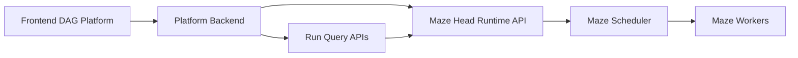

# Maze Runtime API：前端 DAG 平台对接说明

本文档面向独立前端平台开发者。目标是让一个外部可视化 DAG 平台把用户构建的工作流提交给 Maze 后端执行，并通过统一运行态接口展示执行状态、事件、日志和产物。

## 我们是什么

Maze 在这个架构里是 **runtime backend**：

- 接收一个完整 DAG 描述。
- 校验 DAG、任务代码、输入输出、资源和依赖边。
- 编译成 Maze 静态 workflow。
- 交给 Maze scheduler / workers 分布式执行。
- 持久化 run、task、event、artifact、log 等运行信息。

外部平台负责：

- 可视化编辑 DAG。
- 管理项目、节点模板、权限、版本、草稿。
- 生成 Maze 可接收的 `maze.workflow/v1` JSON。
- 调用 Maze runtime API。
- 展示 Maze 返回的 run 状态和事件。



## 我们需要什么

外部平台提交给 Maze 的最小信息包括：

- `nodes`：DAG 节点，每个节点对应一个可执行 Maze code task。
- `edges`：节点输出到节点输入的依赖关系。
- `inputs`：用户输入值或来自上游节点输出的引用。
- `outputs`：每个节点声明的输出字段。
- `resources`：CPU/GPU/内存资源需求。
- `run`：workspace、artifact、timeout 等运行配置。

Maze 不负责保存前端草稿，也不负责节点模板 UI。Maze 只保证：给定合法 `DagSpec`，可以提交执行并提供运行态查询。

## 推荐通信方式

外部平台后端只需要对接两个提交接口：

```text
POST /workflows/validate
POST /workflows/submit
```

运行态查询复用统一 run APIs：

```text
GET  /runs/{run_id}
GET  /runs/{run_id}/tasks
GET  /runs/{run_id}/events?after=<seq>
GET  /runs/{run_id}/artifacts
GET  /runs/{run_id}/logs
POST /runs/{run_id}/cancel
```

不建议外部平台直接依赖这些低层接口：

```text
POST /create_workflow
POST /add_task
POST /save_task_and_add_edge
POST /run_workflow
```

这些接口更接近 Maze 内部拼装流程，长期兼容性不如 `/workflows/submit`。

## DAG Submit Spec

Schema 名称：

```text
maze.workflow/v1
```

示例：

```json
{
  "schema": "maze.workflow/v1",
  "name": "hello-dag",
  "description": "A simple two-node DAG submitted by an external platform.",
  "nodes": [
    {
      "id": "greet",
      "type": "code",
      "task_name": "greet",
      "code": "def greet(name='Maze'):\n    return {'message': f'Hello {name}'}",
      "inputs": {
        "name": "Maze"
      },
      "outputs": ["message"],
      "resources": {
        "cpu": 1,
        "cpu_mem": 128,
        "gpu": 0,
        "gpu_mem": 0
      }
    },
    {
      "id": "upper",
      "type": "code",
      "task_name": "upper",
      "code": "def upper(message):\n    return {'upper': message.upper()}",
      "inputs": {
        "message": {"from": "greet.message"}
      },
      "outputs": ["upper"],
      "resources": {
        "cpu": 1,
        "cpu_mem": 128,
        "gpu": 0,
        "gpu_mem": 0
      }
    }
  ],
  "edges": [
    {"from": "greet.message", "to": "upper.message"}
  ],
  "run": {
    "artifact_mode": true,
    "timeout_seconds": 600
  },
  "tags": ["external-platform"],
  "metadata": {
    "project_id": "project-a",
    "draft_id": "draft-123"
  }
}
```

### Node 字段

| 字段 | 必填 | 说明 |
|---|---:|---|
| `id` | 是 | 平台内稳定节点 ID。只能使用字母、数字、下划线、短横线，且必须以字母或下划线开头。 |
| `type` | 否 | 当前支持 `code` / `python_task` / `task`，都会归一化为 Maze code task。 |
| `task_name` | 否 | 展示和调度使用的任务名，默认等于 `id`。 |
| `code` / `code_str` | 二选一 | Python 函数字符串，函数必须返回 dict。 |
| `code_ser` | 二选一 | base64-cloudpickle 序列化任务函数。和 `code/code_str` 至少提供一个。 |
| `inputs` | 否 | 输入字典，值可以是字面量，也可以是 `{"from": "node.output"}`。 |
| `outputs` | 是 | 输出字段列表，例如 `["result"]`，或对象列表 `[{ "name": "result", "data_type": "str" }]`。 |
| `resources` | 否 | `cpu`、`cpu_mem`、`gpu`、`gpu_mem`。 |
| `timeout_seconds` | 否 | 单任务超时时间。 |
| `max_retries` | 否 | 单任务最大重试次数。 |
| `retry_backoff_seconds` | 否 | 重试等待秒数。 |
| `retry_on` | 否 | 可重试错误类型列表。 |
| `metadata` | 否 | 平台自定义节点元数据。 |

### Edge 字段

推荐写法：

```json
{"from": "greet.message", "to": "upper.message"}
```

也支持显式字段：

```json
{
  "source_task_id": "greet",
  "source_output": "message",
  "target_task_id": "upper",
  "target_input": "message"
}
```

如果 `inputs` 已经写了 `{"from": "greet.message"}`，`edges` 中也写同一条边，Maze 会按同一依赖处理，不会报重复。

### Run 字段

| 字段 | 说明 |
|---|---|
| `workspace_dir` / `workspace` | 任务文件工作区。 |
| `artifact_mode` | 是否使用 Maze Head HTTP artifact store 传输文件。默认 `true`。 |
| `file_context` | 高级用法：直接传 Maze file context。 |
| `timeout_seconds` | 整个 run 超时时间。 |
| `tags` | run 标签。 |
| `metadata` | run 元数据。 |

## 校验 DAG

请求：

```http
POST /workflows/validate
Content-Type: application/json
```

```json
{
  "spec": {
    "schema": "maze.workflow/v1",
    "name": "hello-dag",
    "nodes": [],
    "edges": []
  }
}
```

成功响应：

```json
{
  "status": "success",
  "spec": {
    "schema": "maze.workflow/v1",
    "name": "hello-dag"
  }
}
```

失败响应使用 HTTP 400：

```json
{
  "detail": "nodes must be a non-empty list"
}
```

## 提交 DAG

请求：

```http
POST /workflows/submit
Content-Type: application/json
```

```json
{
  "spec": {
    "schema": "maze.workflow/v1",
    "name": "hello-dag",
    "nodes": [
      {
        "id": "greet",
        "code": "def greet():\n    return {'message': 'hello'}",
        "outputs": ["message"]
      }
    ],
    "edges": []
  },
  "tags": ["external-platform"],
  "metadata": {
    "project_id": "project-a"
  }
}
```

成功响应：

```json
{
  "status": "success",
  "workflow_id": "workflow-uuid",
  "run_id": "run-uuid",
  "spec": {
    "schema": "maze.workflow/v1",
    "name": "hello-dag"
  }
}
```

平台应保存 `run_id`，后续用它查询运行状态。

## 查询运行状态

### Run 快照

```http
GET /runs/{run_id}
```

返回 run 状态、时间、进度、错误摘要、任务快照等。

### 任务列表

```http
GET /runs/{run_id}/tasks
```

用于渲染 DAG 节点状态，例如 `pending`、`queued`、`running`、`succeeded`、`failed`。

### 增量事件

```http
GET /runs/{run_id}/events?after=<seq>
```

建议前端平台后端轮询该接口，或包装成自己的 SSE/WebSocket 给浏览器。

### 产物与日志

```http
GET /runs/{run_id}/artifacts
GET /runs/{run_id}/logs
```

文件下载使用 artifact 返回的 `sha256`：

```http
GET /artifacts/sha256/{sha256}
```

## Python SDK

```python
from maze import MaClient

client = MaClient("http://localhost:8000")

normalized = client.validate_workflow_spec(spec)
submitted = client.submit_workflow(
    spec,
    tags=["external-platform"],
    metadata={"project_id": "project-a"},
)

run_id = submitted["run_id"]
run = client.get_run(run_id)
tasks = client.get_run_tasks(run_id)
events = client.get_run_events(run_id)
```

## 对接建议

- 平台项目里保存自己的 DAG draft，不要把 Maze run snapshot 当作草稿存储。
- 节点模板、权限、参数表单、版本管理都建议放在平台侧。
- Maze spec 里的 `id` 应该使用平台稳定节点 ID，便于 run 结果映射回画布节点。
- 推荐平台后端调用 Maze，不建议浏览器直接调用 Maze Head。
- 对生产环境，不建议直接让用户输入任意 Python 源码；应使用平台侧审核过的 task template 或 code artifact。
